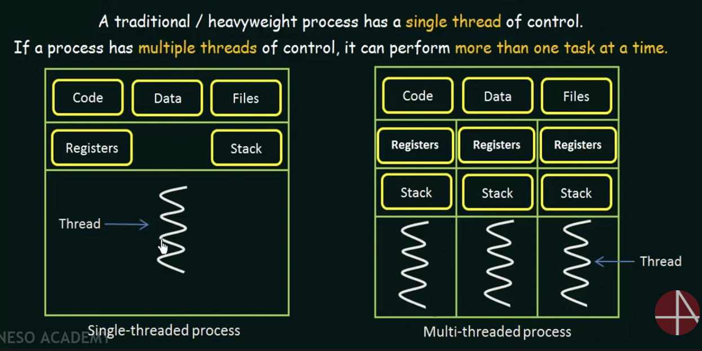

- thread is a basic unit of CPU utilization
- each thread can share code section, data section, other operation-system resources(open files and signals)

( system)

- benefits for multithreading programming
    - responsiveness
    - resource sharing : different threads of activity within the same address space.
    - economy : it is more economical than context-switch threads.
    - utilization of multiprocessor architectures...

reference: https://www.youtube.com/watch?v=LOfGJcVnvAk&list=RDCMUCQYMhOMi_Cdj1CEAU-fv80A&start_radio=1&rv=LOfGJcVnvAk&t=801